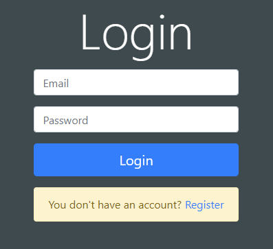
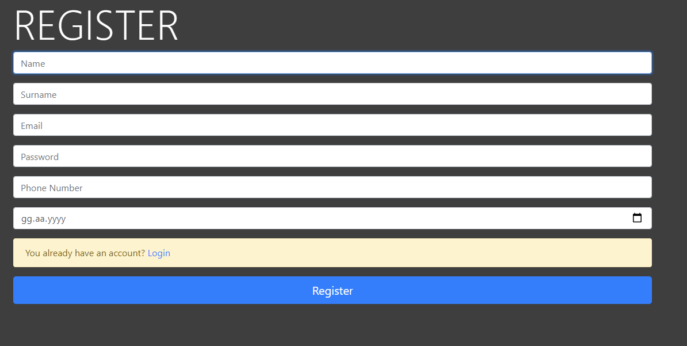
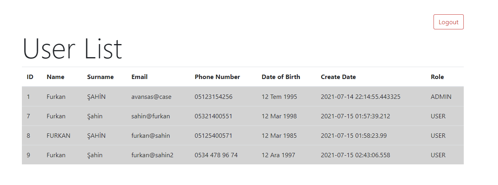
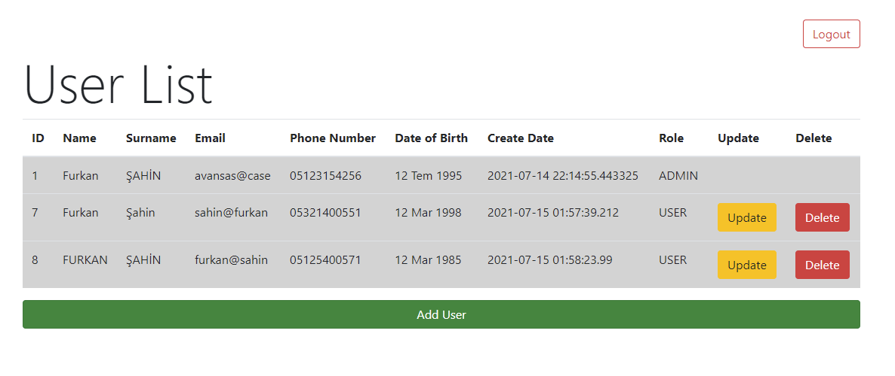
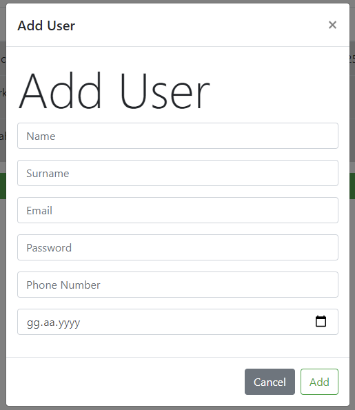
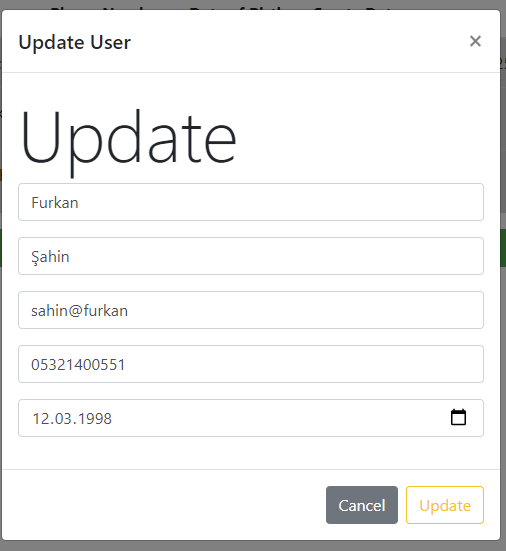
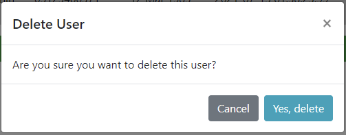

# Avansas Case Study

Basic user management system with Spring Boot & JSP.

#### Used Technologies

----

- Spring Data JPA
- Spring Web
- PostgreSQL
- Spring Security
- Hibernate Validation
- Swagger UI
- Mapstruct
- Guava
- JSTL
- JQuery
- Bootstrap

#### Screenshots

----

**Login Page**

**Register Page**

**User List Page (User)**

**User List Page (Admin)**

**Add User Modal (Admin)**

**User Update Modal (Admin)**

**User Delete Modal (Admin)**

